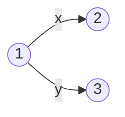
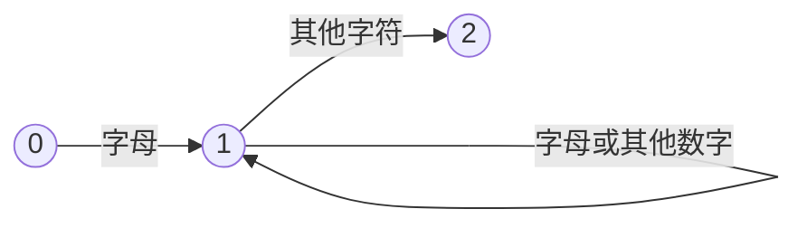

# 编译原理

## 词法分析

### 词法分析器

#### 功能

1. 识别出源程序中的各个单词符号,并将其转换为内部编码形式.
2. 删除无用的空白符,回车符以及无用的非实质性字符.
3. 删除注释
4. 进行语法检查

#### 工作方式

1. 词法分析器作为编译器独立执行任务
2. 词法分析器作为语法分析器的子程序执行任务
3. 词法分析器和语法分析器并行工作

### 形式化描述

#### 语言

**定义**:**有限**字母表上$\Sigma$上**有限**长度的字符串的集合

##### 常用名词

> **前缀**:移走字符串尾部的任意个符号后余下的部分
> **后缀**:移走字符串头部的任意个符号后余下的部分
> **子串**:移走前缀和后缀的字符串余下的部分
> **子序列**:从字符串中的任意个位置删除任意个符号后余下的部分
> **逆转**:将字符串中的符号按相反次序写出的字符串
> **连接**:x和y是字符串,连接xy是将y的符号接在x的符号之后
> **幂**:一个字符串和自身的n-1次连接

##### 运算

$L$和$M$都是一个字符串集合

1. **合并**:$$L\cup M=\{s\mid s\in L\vee s\in M\}$$
2. **连接**:$$LM=\{st\mid s\in L\wedge t\in M\}$$
3. **幂**:$$L^0=\{\epsilon\},L^1=L,L^2=LL,L^n=L^{n-1}L$$
4. **Kleene闭包**:$$L^*=\overset{\infin}{\cup}L^i=L^0\cup L^1\cup \cdots\quad i\geq 0$$
5. **正闭包**:$$L^+=\overset{\infin}{\cup}L^i=L^1\cup L^2\cup\cdots\quad i\geq 1$$

#### 正规式和正规集

**常用名词**:
> 1.L(r)表示由字母表r构成的语言
> 2.正规集表示用正规式描述的语言

##### 定义字母表$\Sigma$上的正规式

1. $\epsilon,\emptyset$是$\Sigma$上的正规式,表示的正规集为$\{\epsilon\},\emptyset$
2. $\forall a\in \Sigma$,$a$是$\Sigma$上的正规式,表示的正规集为$\{a\}$
3. 假定$e_1,e_2$为$\Sigma$上的正规式,表示的正规集为$L(e_1),L(e_2)$则
   1. $(e_1\mid e_2)$为正规式,表示的正规集为$L(e_1)\cup L(e_2)$
   2. $(e_1\cdot e_2)$为正规式,表示的正规集为$L(e_1)L(e_2)$
   3. $(e_1)^*$为正规式,表示的正规集为$(L(e_1))^*$
有限使用以上三个步骤定义的表达式称为$\Sigma$上的正规式

> 运算顺序
> 闭包运算优先级最高,左结合
> 连接运算优先级第二,左结合
> 或运算优先级最低,左结合

##### 运算性质

常用运算性质:
> $A|B = B|A$
>
> $A|(B|C)=(A|B)|C$
>
> $A(BC)=(AB)C$
>
> $A(B|C)=AB|AC\qquad(A|B)C=AC|BC$
>
> $\epsilon A=A\quad A\epsilon = A$
>
> $A^*=(A|\epsilon)^*$
>
> $A^{**}=A^*$

##### 简化正规式

1. 正闭包:$r$为表示$L(r)$正规式,$r^+$为表示$(L(r))^+$的正规式且$$r^+=rr^*=r^*r,r^*=r^+\mid\epsilon$$
2. 可缺省:$r$为表示$L(r)$正规式,$r?$为表示$L(r)\cup\{\epsilon\}$的正规式
3. 字符组:
   1. 枚举方式:$$[abc]=a|b|c$$
   2. 分段方式:$$[0-9]=[0123456789]$$
4. 非字符组:若$[r]$是一个正规式,则$[^r]$表示$\Sigma-L(r)$

### 有限状态自动机

#### 状态转换图

由一组矢量线连接的有限个节点组成的有向图,每个节点均代表识别单词时语法分析器所处的状态

**例如**:从状态一输入x则读入x到状态2,输入y则读入y到状态3



**例如**:可以识别一定的字符串



#### 非确定型有限状态自动机(NFA)

##### 定义

NFA是一个五元组:$$M=(S,\Sigma,move,s_0,F)$$

> $S$:一个有限的状态集合
> $\Sigma$:一个输入符号的集合
> $move$:$S\times\Sigma\rarr S$是一个状态转移函数,$move(s_i,ch)=s_j$表示$s_i$状态遇到输入字符$ch$转移到$s_j$状态
> $s_0$为初始状态
> $F$为终态集合,$F\subseteq S$

#### 确定型有限自动机

##### DFA定义

1. DFA是NFA的一种
2. 任何状态没有$\epsilon$转换
3. 对任何状态$s_j$和任意输入符号$a$,最多只有一条标记着$a$的便离开$s_j$.

### 正规式到词法分析器

#### 由正规式构造等价的NFA(Thompson算法)

步骤:

1. 对于$\epsilon$构造NFA如下

    ```mermaid
    graph LR
    D0((s0))
    D1((f))

    D0-- ε --> D1
    ```

2. 对于$\Sigma$中的每个符号$a$构造NFA

    ```mermaid
    graph LR
    D0((s0))
    D1((f))

    D0-- a --> D1
    ```

3. 如果$M(p)$和$M(q)$分别是正规式$p$和$q$的NFA则
   1. 对于正规式$p|q$构造合成NFA:$M(p|q)$结果如下:

        ```mermaid
        graph LR
        D0((s0))
        D1((Sp))
        D2((Sq))
        D3((Fp))
        D4((Fq))
        D5((f))

        subgraph "M(q)"
            D1-->D3
        end
        subgraph "M(p)"
            D2-->D4
        end
        D0-- ε -->D1
        D0-- ε -->D2
        D3-- ε -->D5
        D4-- ε -->D5
        ```

   2. 对于正规式$pq$构造合成NFA:$M(pq)$结果如下:

    ```mermaid
    
    ```
