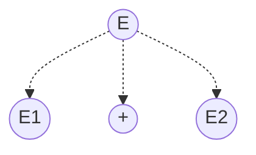
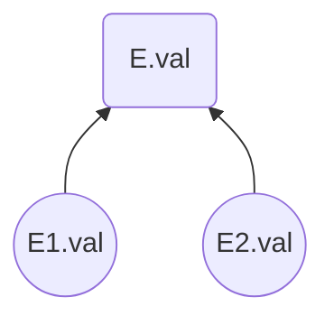

# 编译原理

## 词法分析

### 词法分析器

#### 功能

1. 识别出源程序中的各个单词符号,并将其转换为内部编码形式.
2. 删除无用的空白符,回车符以及无用的非实质性字符.
3. 删除注释
4. 进行语法检查

#### 工作方式

1. 词法分析器作为编译器独立执行任务
2. 词法分析器作为语法分析器的子程序执行任务
3. 词法分析器和语法分析器并行工作

### 形式化描述

#### 语言

**定义**:**有限**字母表上$\Sigma$上**有限**长度的字符串的集合

##### 常用名词

> **前缀**:移走字符串尾部的任意个符号后余下的部分
> **后缀**:移走字符串头部的任意个符号后余下的部分
> **子串**:移走前缀和后缀的字符串余下的部分
> **子序列**:从字符串中的任意个位置删除任意个符号后余下的部分
> **逆转**:将字符串中的符号按相反次序写出的字符串
> **连接**:x和y是字符串,连接xy是将y的符号接在x的符号之后
> **幂**:一个字符串和自身的n-1次连接

##### 运算

$L$和$M$都是一个字符串集合

1. **合并**:$$L\cup M=\{s\mid s\in L\vee s\in M\}$$
2. **连接**:$$LM=\{st\mid s\in L\wedge t\in M\}$$
3. **幂**:$$L^0=\{\epsilon\},L^1=L,L^2=LL,L^n=L^{n-1}L$$
4. **Kleene闭包**:$$L^*=\overset{\infin}{\cup}L^i=L^0\cup L^1\cup \cdots\quad i\geq 0$$
5. **正闭包**:$$L^+=\overset{\infin}{\cup}L^i=L^1\cup L^2\cup\cdots\quad i\geq 1$$

#### 正规式和正规集

**常用名词**:
> 1.L(r)表示由字母表r构成的语言
> 2.正规集表示用正规式描述的语言

##### 定义字母表$\Sigma$上的正规式

1. $\epsilon,\emptyset$是$\Sigma$上的正规式,表示的正规集为$\{\epsilon\},\emptyset$
2. $\forall a\in \Sigma$,$a$是$\Sigma$上的正规式,表示的正规集为$\{a\}$
3. 假定$e_1,e_2$为$\Sigma$上的正规式,表示的正规集为$L(e_1),L(e_2)$则
   1. $(e_1\mid e_2)$为正规式,表示的正规集为$L(e_1)\cup L(e_2)$
   2. $(e_1\cdot e_2)$为正规式,表示的正规集为$L(e_1)L(e_2)$
   3. $(e_1)^*$为正规式,表示的正规集为$(L(e_1))^*$
有限使用以上三个步骤定义的表达式称为$\Sigma$上的正规式

> 运算顺序
> 闭包运算优先级最高,左结合
> 连接运算优先级第二,左结合
> 或运算优先级最低,左结合

##### 运算性质

常用运算性质:
> $A|B = B|A$
>
> $A|(B|C)=(A|B)|C$
>
> $A(BC)=(AB)C$
>
> $A(B|C)=AB|AC\qquad(A|B)C=AC|BC$
>
> $\epsilon A=A\quad A\epsilon = A$
>
> $A^*=(A|\epsilon)^*$
>
> $A^{**}=A^*$

##### 简化正规式

1. 正闭包:$r$为表示$L(r)$正规式,$r^+$为表示$(L(r))^+$的正规式且$$r^+=rr^*=r^*r,r^*=r^+\mid\epsilon$$
2. 可缺省:$r$为表示$L(r)$正规式,$r?$为表示$L(r)\cup\{\epsilon\}$的正规式
3. 字符组:
   1. 枚举方式:$$[abc]=a|b|c$$
   2. 分段方式:$$[0-9]=[0123456789]$$
4. 非字符组:若$[r]$是一个正规式,则$[^r]$表示$\Sigma-L(r)$

### 有限状态自动机

#### 状态转换图

由一组矢量线连接的有限个节点组成的有向图,每个节点均代表识别单词时语法分析器所处的状态

**例如**:从状态一输入x则读入x到状态2,输入y则读入y到状态3


**例如**:可以识别一定的字符串


#### 非确定型有限状态自动机(NFA)

##### 定义

NFA是一个五元组:$$M=(S,\Sigma,move,s_0,F)$$

> $S$:一个有限的状态集合
> $\Sigma$:一个输入符号的集合
> $move$:$S\times\Sigma\rarr S$是一个状态转移函数,$move(s_i,ch)=s_j$表示$s_i$状态遇到输入字符$ch$转移到$s_j$状态
> $s_0$为初始状态
> $F$为终态集合,$F\subseteq S$

#### 确定型有限自动机

##### DFA定义

1. DFA是NFA的一种
2. 任何状态没有$\epsilon$转换
3. 对任何状态$s_j$和任意输入符号$a$,最多只有一条标记着$a$的便离开$s_j$.

### 正规式到词法分析器

#### 由正规式构造等价的NFA(Thompson算法)

步骤:

1. 对于$\epsilon$构造NFA如下

    ```mermaid
    graph LR
    D0((s0))
    D1((f))

    D0-- ε --> D1
    ```

2. 对于$\Sigma$中的每个符号$a$构造NFA

    ```mermaid
    graph LR
    D0((s0))
    D1((f))

    D0-- a --> D1
    ```

3. 如果$M(p)$和$M(q)$分别是正规式$p$和$q$的NFA则
   1. 对于正规式$p|q$构造合成NFA:$M(p|q)$结果如下:

        ```mermaid
        graph LR
        D0((s0))
        D1((Sp))
        D2((Sq))
        D3((Fp))
        D4((Fq))
        D5((f))

        subgraph "M(q)"
            D1-->D3
        end
        subgraph "M(p)"
            D2-->D4
        end
        D0-- ε -->D1
        D0-- ε -->D2
        D3-- ε -->D5
        D4-- ε -->D5
        ```

   2. 对于正规式$pq$构造合成NFA:$M(pq)$结果如下:

        ```mermaid
        graph LR
        D0((s0))
        D1((sf))
        D2((f))
        D3((sf))
        subgraph "M(p)"
            D0-->D1
        end
        subgraph "M(q)"
            D1-- ε -->D3
            D3-->D2
        end
        ```

   3. 对于正规式$p^*$构造如下

        ```mermaid
        graph TD
        D0((s0))
        D1((Sp))
        D2((Fp))
        D3((f))
        subgraph "M(p)" 
            D2-- ε -->D1
        end
        D0-- ε -->D1
        D2-- ε -->D3
        ```

4. 对于括起来的正规式$(p)$用$M(p)$本身作为它的NFA

#### NFA到DFA

> 名词定义:
> 1.$\epsilon$_CLOSURE($I$):
> 如果$q\in I$,则$q\in \epsilon \_CLOSURE(I)$
> 如果$q\in I$,则$q'$为经过任意条$\epsilon$边可以到达的状态,这些状态都属于$\epsilon$_CLOSURE($I$)
> $I$是状态集的一个子集,$a\in \Sigma$,定义$I_a = \epsilon \_CLOUSURE(J)$,其中J是从I中的任意一个状态节点出发经过一条$a$边和任意条$\epsilon$边能到达的状态的全体

##### NFA到DFA的确定化方法

构造一张表格,该表格有n列,n为字母表的个数,可以将每一列命名为$I_x$,x为字母表中的字母.

1. 首先置第一行第一列为$\epsilon$_CLOSURE($X$),X为初态,该项为初态的闭包.
2. 根据上述的定义依次在后面的每一行填入相应$I_x$
3. 检查填入的$I_x$,如果它没有在第一列出现过,将其填入到第一列的末尾空项中,如果出现过则略过这一项
4. 对未填入$I_x$的每一行重复该过程,直到表所有产生的$I_x$在第一列都出现过为止.
5. 将表中的每一项赋予一个新的状态名
6. 根据新的状态转移表画DFA

例如:
NFA如下:


由于字母表中有两个元素a,b所以状态转化矩阵共有三列,如下所示:

|$I$|$I_a$|$I_b$|
|:---:|:---:|:---:|
|$\{0,1,2,4,7\}$|$\{3,8,6,7,1,2,4\}$|$\{5,6,7,1,2,4\}$|
|$\{3,8,6,7,1,2,4\}$|$\{8,3,6,7,1,2,4\}$|$\{9,5,6,7,1,2,4\}$|
|$\{5,6,7,1,2,4\}$|$\{8,3,6,7,1,2,4\}$|$\{5,6,7,1,2,4\}$|
|$\{9,5,6,7,1,2,4\}$|$\{8,3,6,7,1,2,4\}$|$\{10,5,6,7,1,2,4\}$|
|$\{10,5,6,7,1,2,4\}$|$\{8,3,6,7,1,2,4\}$|$\{5,6,7,1,2,4\}$|

将其重命名可以得到如下矩阵
其
|S|a|b|
|:---:|:---:|:---:|
|A|B|C|
|B|B|D|
|C|B|C|
|D|B|E|
|E|B|C|

生成的DFA如下


##### 状态转移表的化简

如果对于任意的输入x,p和q转移后的状态相同,认为p和q等价,可以将等价的状态合一.

## 语法分析

### 上下文无关文法CFG

#### CFG的定义

> 一个CFG为一个四元组G=(N,T,P,S)
> N为一个非空有限集合,元素为非终结符,非终结符定义了终结符串的集合
> T为一个非空有限集合,元素为终结符,$T\cap N=\emptyset$
> P为产生式的集合,产生式为$A\rarr a$,$A\in N,a\in(T\cup N)^*$,指出了终结符和非终结符组成串的形式
> S为开始符号

#### 语法分析的术语

##### 推导

利用产生式生成句子的过程,使用产生式$A\rarr \gamma$的右部代替文法符号序列$\alpha A\beta$中的A得到$\alpha\gamma\beta$的过程称为$\alpha A\beta$直接推导出$\alpha\gamma\beta$记作$\alpha A\beta\rArr\alpha\gamma\beta$


可以使用符号$\overset{*}{\rArr}$来表示多步推导,即对一个表达式多次使用相同或不同的产生式得到的句子.

推导具有传递性,自反性

##### 上下文无关语言$L(G)$

由CFG G所产生的语言$L(G)$被定义为$$L(G)=\{\omega\mid S\overset{*}{\rArr}\omega \quad and \quad \omega\in T^*\}$$

##### 最左推导和左句型

在推导过程中,每次都替换掉句型中最左边的非终结符,这样的推导称为最左推导,由最左推导产生的句型称为左句型

#### 语法树和二义性

##### 语法树

定义: 设$G=(N,T,P,S)$是一个文法,满足以下条件

1. 每一个节点有一个标记$X$,$X\in N\cup T$
2. 每一个节点由根可达
3. 如果节点有后继,则$X\in N$
4. 若$A$有$k$个后继,从左到右为$X_1,X_2,\cdots,X_k$,则$A\rarr X_1X_2\cdots X_k\in P$

类似于把一个由非终结符构成的句子进行展开,把非终结符不断的依次展开,最后的所有叶子都是终结符.

### 自上而下的语法分析

从语法开始符号出发,为已给定的字符串构造一个最左推导

#### 文法的左递归

如果文法中出现这样的产生式$A\rarr A\alpha$,称该产生式对A直接左递归,显然不能用自上而下的语法分析

##### 消除文法的左递归

假设有这样的文法$A\rarr A\alpha\mid \beta$,且$\beta$不以$A$为开头,改写为$$A\rarr \beta A'$$$$A'\rarr \alpha A'\mid \epsilon$$

例如:$$S\rarr Aa\mid b$$$$A\rarr Sc\mid\epsilon$$没有直接左递归,但是用$S\rarr Aa\mid b$代入$A\rarr Sc\mid\epsilon$就出现了直接左递归$A\rarr Aac\mid bc\mid\epsilon$消去左递归得到$$S\rarr Aa\mid b$$$$A\rarr bcA'\mid A'$$$$A'\rarr acA'\mid\epsilon$$

#### 递归下降分析法

例如:给出文法$G[S]$为$$\begin{align*}
S&\rarr E+S\mid\epsilon\\
E&\rarr E+S\mid E-T\mid T\\
T&\rarr T*F\mid T/F\mid T \quad mod\quad F \mid F
F&\rarr (E)\mid i\mid num
\end{align*}$$
消去左递归和左因子得到了递归下降分析所需的文法$$\begin{align*}
    S&\rarr E+S\mid\epsilon\\
    E&\rarr TE'\\
    E'&\rarr +TE'\mid -TE'\mid \epsilon\\
    T&\rarr FT'\\
    T'&\rarr *FT'\mid /FT'\mid mod\quad FT'\mid\epsilon\\
    F&\rarr (E)\mid i\mid num\\
\end{align*}$$构造状态转换图构造方法如下

1. 为非终结符$A$建立一个初态和一个终态
2. 为$A\rarr X_1X_2\cdots X_n$构造从初态到终态的路径,边标记为$X_n$
3. 根据识别同一集合的方式,化简状态转换图

化简规则:

1. 标记为A的边可等价为标记$\epsilon$的边转向A状态转换图的初态
2. 标记为$\epsilon$的边所连接的两个状态可以合并
3. 标记相同的路径可以合并
4. 等价的状态可以合并

##### 文法的EBNF表示规则

> <>:尖括号内为语法构造成分,为非终结符
> ::= 表示该符号的左部由右部定义
> | 表示或的关系
> {} 表示其内的语法成分可以重复,可以加上重复的上下界
> [] 表示其中的成分为任选项

化简所得的语法为:$$\begin{align*}
    S&\rarr\{E+\}\\
    E&\rarr T\{(+|-)T\}\\
    T&\rarr F\{(*|/|mod)F\}\\
    F&\rarr (E)|i|nuum\\
\end{align*}$$

#### 预测分析法

##### FIRST集合和FOLLOW集合

FIRST:
文法符号序列$\alpha$的FIRST定义如下:$$FIRST(\alpha)=\{a|\alpha\overset{*}{\rArr}a\cdots,a\in T\}$$如果$\alpha\overset{*}{\rArr}\epsilon$有$\epsilon\in FIRST(\alpha)$

FOLLOW:
非终结符A的FOLLOW集合定义如下:$$FOLLOW(A)=\{a|S\overset{*}{\rArr}\cdots Aa\cdots,a\in T\}$$若A是某句型的最右符号,则$\#\in FOLLOW(A)$

###### FIRST集合的计算

设符号为X文法中的一个符号

1. 若$X\in T$,则$FIRST(X)=\{X\}$
2. 若$X\in N$,且$X\rarr a\alpha \in P,a\in T$,则令$a\in FIRST(X)$,若$X\rarr\epsilon\in P$,则令$\epsilon\in FIRST(X)$
3. 若$X\rarr Y_1Y_2\cdots Y_k\in P$,且$Y_1\in N$,则令令$FIRST(Y_1)-\{\epsilon\}\subseteq FIRST(X)$,对接下来的$Y_2Y_3\cdots Y_k$,如果一个$Y_i$之前的所有项都有$Y\overset{*}{\rArr}\epsilon$,就把$FIRST(Y_i)-\{\epsilon\}\in FIRST(X)$,如果存在$\epsilon\in Y$,把$\epsilon\subseteq FIRST(X)$

###### FOLLOW集合的计算

1. 对于文法的开始符号S,令$\# \in FOLLOW(S)$
2. 对于每一个产生式$A\rarr \alpha B \beta \in P$,令$FIRST(\beta)-\{\epsilon\}\subseteq FOLLOW(B)$
3. 对于每个产生式$A\rarr \alpha B\in P$或$A\rarr \alpha B \beta$,且$\epsilon\in FIRST(\beta)$,则令$FOLLOW(A)\subseteq FOLLOW(B)$

###### 构造预测分析表

1. 对于每一个产生式$A\rarr \alpha$执行以下步骤
2. $\forall a \in FIRST(A)$,把$A\rarr \alpha$加入到$M[A,a]$中
3. 如果$\epsilon\in FIRST(A)$,对$FOLLOW(A)$的每个终结符$b$,把$A\rarr\epsilon$加入到$M[A,b]$

### 自下而上的语法分析

#### 自下而上的语法分析的名词定义

##### 句柄

假设$\alpha\beta\delta$为文法$G$的一个句型(符合文法的句子),如果存在这样一个推导$S\overset{*}{\rArr}\alpha A\delta$,且$A\overset{+}{\rArr}\beta$,则称$\beta$为句型$\alpha\beta\delta$相对于$A$的短语;若$A\rarr\beta$,则称$\beta$为句型$\alpha\beta\delta$相对于$A\rarr\beta$的直接短语

一个句型的最左直接短语称为句柄,短语,直接短语,和句柄可以通过画语法树得到.

语法树中,短语为以任意一个非终结符为根的树,将其的叶子节点从左到右排起来.

直接短语为以非终结符为根,所有子结点全部为叶子节点的树,把子结点从左到右排起来

句柄为最左边的直接短语

#### LR分析法

##### LR(0)分析表的构造

文法:$$\begin{align*}
    &S'\rarr E\\
    &E\rarr aA|bB\\
    &A\rarr cA|d\\
    &B\rarr cB|d\\
\end{align*}$$

该文法构造的项目有18个$$\begin{align*}
    1:&S'\rarr\cdot E\\
    2:&S'\rarr E\cdot\\
    3:&E\rarr\cdot aA\\
    4:&E\rarr a\cdot A\\
    5:&E\rarr aA\cdot\\
    6:&A\rarr\cdot cA\\
    7:&A\rarr c\cdot A\\
    8:&A\rarr cA\cdot\\
    9:&A\rarr\cdot d\\
    10:&A\rarr d\cdot\\
    11:&E\rarr\cdot bB\\
    12:&E\rarr b\cdot B\\
    13:&E\rarr bB\cdot\\
    14:&B\rarr\cdot cB\\
    15:&B\rarr c\cdot B\\
    16:&B\rarr cB\cdot\\
    17:&B\rarr \cdot d\\
    18:&B\rarr d\cdot\\
\end{align*}$$

1. 规定项目1为NFA的唯一初态
2. 对于出自同一产生式的状态i和j,且状态j的圆点只落后状态i的一个位置,即状态i为$$X\rarr X_1\cdots X_{i-1}\cdot X_i\cdots X_n$$状态j为:$$X\rarr X_1\cdots X_{i}\cdot X_{i+1}\cdots X_n$$,从状态i画一条弧到状态j,弧标记为$X_i$.
3. 如果状态i为$X\rarr a\cdot A\beta$,$A$为非终结符,从状态i画$\epsilon$弧到所有的$A\rarr\cdot \gamma$状态
4. 按照NFA化为DFA的方法化为DFA,化简DFA,DFA中的项目记为I

得到NFA如下:


得到DFA如下:


得到DFA后按如下步骤构造LR分析表

1. 若项目$A\rarr\alpha\cdot a\beta$属于项目$I_k$,且从$I_k$到$I_j$有标记为$a$的弧即$GO(I_k,a)=I_j$把$ACTION[k,a]$放置将$(j,a)$进栈记为$s_j$
2. 若项目$A\rarr a\cdot$属于项目$I_k$,对任何终结符,把$ACTION[k,a]$放置用产生式$A\rarr a$规约,记为$r_j$,设产生式$A\rarr a$为文法的第$j$个产生式
3. 若项目$S'\rarr S\cdot$属于项目$I_k$,则把$ACTION[k,\#]$放置为接受记为$acc$
4. 若$GO(I_k,A)=I_j$,A为非终结符,则放$GOTO[k,A]$为$j$

具体操作:项目集对应状态(行),终结符和非终结符对应(列),如果是项目集1和2间的连线,如果是终结符,就在项目集1的行,对应的终结符的列写s2;
如果是连线是非终结符,就在该行对应的非终结符的列的位置标2,2代表项目集2
如果项目集点在最后面(只有进的线,没有出的线),在该行对应的所有终结符的列上填上项目集里的产生式(项目集里对应的在题目中给出的产生式)的编号

|状态|a|b|c|d|#|E|A|B|
|:---:|:---:|:---:|:---:|:---:|:---:|:---:|:---:|:---:|
|0|s2|s3||||1|||
|1|||||acc||||
|2|||s4|s10|||6||
|3|||s5|s11||||7|
|4|||s4|s10||8|||
|5||||s11||||9
|6|r1|r1|r1|r1|r1||||
|7|r2|r2|r2|r2|r2||||
|8|r3|r3|r3|r3|r3||||
|9|r5|r5|r5|r5|r5||||
|10|r4|r4|r4|r4|r4||||
|11|r6|r6|r6|r6|r6||||

##### SLR分析表的构造

在构造LR(0)分析表的基础上,当出现以下项目集时$$I=\left\{\begin{align*}
    X\rarr&a\cdot b\beta\\
    A\rarr&a\cdot\\
    B\rarr&a\cdot\\
\end{align*}\right\}$$在面对在面对任何输入符号$a$采取以下三种决策方法:

1. $a=b$,移进
2. $a\in FOLLOW(A)$,用产生式$A\rarr a$进行规约
3. $a\in FOLLOW(B)$,用产生式$B\rarr a$进行规约

一般来说,假定LR(0)中的一个项目集有$m$个移进项目:$$A_1\rarr \alpha\cdot a_1\beta_1,A_2\rarr \alpha\cdot a_2\beta_2,\cdots,A_m\rarr \alpha\cdot a_m\beta_m$$,$n$个规约项目:$$B_1\rarr\alpha\cdot,B_2\rarr\alpha\cdot,\cdots,B_n\rarr\alpha\cdot$$.
当集合$\{a_1,a_2,\cdots,a_m\},FOLLOW(B_1),FOLLOW(B_2),\cdots,FOLLOW(B_n)$两两不相交时,可采取类似上面的方法进行解决,具体如下

1. $a=a_i,(i=1,2,\dots,m)$时移进
2. $a\in FOLLOW(B_i),(i=1,2,\dots,n)$,用产生式$B_i\rarr a$进行规约

## 语法制导翻译与中间代码生成

### 语法制导翻译

#### 语法与语义

> 语法:语言的结构
> 语义:附着与结构上的实际含义

||描述|实现|
|:---:|:---:|:---:|
|词法分析器|正规式(正则表达式)|有限自动机|
|语法分析器|上下文无关文法(CFG)|下推自动机|

##### 语义分析的作用

1. 检查是否结构正确的句子所表示的意思也合法
2. 执行规定的语义动作

#### 属性文法

1. 将文法符号所代表的语言结构的意思,用附着于该文法符号的属性表示
2. 用语义规则规定产生式所代表的语言结构之间的关系(即属性之间的关系),即用语义规则实现属性计算

##### 属性文法的一般表示方法

|文法规则|语义规则|
|:---:|:---:|
|规则1|相关的属性等式/语义规则|

##### 属性分类

1. 综合属性
   1. 用于自下而上传递信息一个,结点的综合属性由其子结点的属性值确定,仅仅使用综合属性的属性文法称S-属性文法
2. 继承属性
   1. 用于自上而下传递信息一个结点的继承属性由此结点的父结点(和/或)兄弟结点的某些属性确定

#### 语义规则

对于文法的每个产生式都配备了一组属性的计算规则

##### 属性定义

对于产生式$A\rarr a$,其中$a=X_1X_2\cdots X_n$,语义规则可以定义为$$b:=f(c_1,c_2,\dots,c_k)$$在语义规则中的属性存在以下关系:

1. 如果$b$是$A$的属性,$c_1,c_2,\dots,c_k$是$a$中$X_1,X_2,\dots,X_n$中的一个或几个符号对应属性,或者是$A$的其他属性.称$b$为$A$的综合属性
2. 若$b$是$a$中$X_i$的属性,$c_1,c_2,\dots,c_k$是$A$的或$a$中其他符号的属性.称$b$是$X_i$的继承属性
3. $b:=f(c_1,c_2,\dots,c_k)$,被记作属性$b$依赖于属性$c_1,c_2,\dots,c_k$

说明:

+ 终结符只有综合属性
+ 非终结符既可有综合属性也可有继承属性,文法开始符号的所有继承属性作为属性计算前的初始值
+ 产生式右边的继承属性和出现在产生式左边的综合属性都必须提供一个计算规则
+ 产生式左边的继承属性和出现在产生式右边的综合属性不由所给的产生式的属性计算规则进行计算

> 继承属性是自上而下进行计算的
> 综合属性是自下而上进行计算的

##### 基于属性文法的处理方法

###### 依赖图

为每一个包含过程调用的语义规则引入一个虚综合属性b,这样把每一个语义规则都写成$$b:=f(c_1,c_2,\dots,c_k)$$
依赖图中为每一个属性设置一个结点,如果属性b依赖于属性c,则从属性c的结点有一条有向边连到属性b的结点
例如:$$E\rarr E_1+E_2$$ $$E.val:=E_1.val+E_2.val$$





###### 树遍历

通过树遍历的方法计算属性的值

1. 假设语法树已建立,且树中已带有开始符号的继承属性和终结符的综合属性
2. 以某种次序遍历语法树,直至计算出所有属性(例如:深度优先,从左到右,先序后序等)

###### 一遍扫描

一遍扫描的处理方法是在语法分析的同时计算属性值

+ 所采用的语法分析方法
+ 属性的计算次序
  + L-属性文法自上而下,一个产生式匹配输入串成功时
  + S-属性文法自下而上,一个产生式被用于进行归约时

### 中间代码

#### 后缀式

操作数在前,操作符紧随其后,无需用括号限制运算的优先级和结合性

#### 三地址码

##### 三地址码语法

```c
result := arg1 op arg2
result := op arg1
op arg1
```

例如:

```c
x:=a+b*c

T1:=b*c
T2:=a+T1
x:=T2
```

#### 四元式

语法:

```c
(op,arg1,arg2,rusult)

result:= arg1 op arg2
```

将由序号所表示的运算结果改为了由临时变量来表示

### 声明语句的翻译

#### 变量的声明

1. 类型定义:为编译器提供存储空间大小的信息
2. 变量声明:为变量分配存储空间

##### 符号表

1. 偏移量(全程量)**offset**:记录当前符号存储的偏移量,初值设为0
2. 属性**type**和**width**:变量的类型和所占据的存储空间
3. 过程enter(name, type, offset)：为type类型的变量name建立符号表条目,并为其分配存储空间(位置)offset

### 过程

#### 过程的三种形式

1. 过程定义
2. 过程声明
3. 过程调用

#### 左值和右值

1. 形式上:出现在赋值号左边和右边的变量分别称为左值和右值
2. 实质上:左值必须具有存储空间,右值可以仅是一个值,而没有存储空间

#### 参数传递

1. 形参与实参
   1. 定义时的参数称为形参(parameter或formal parameter)
   2. 引用时的参数称为实参(argument或actual parameter)
2. 常见的参数传递形式
   1. 值调用(call by value)
   2. 引用调用(call by reference)
   3. 复写－恢复(copy-in/copy-out)
   4. 换名调用(call by name)
3. 实参是代表**左值,右值还是实参本身**的正文

##### 值调用

过程内部对参数的修改,不影响作为实参的变量原来的值
任何可以作为右值的对象均可作为实参

使用原则:

1. 过程定义时形参被当作局部名看待,并在过程内部为形参分配存储单元
2. 调用过程前,首先计算实参并将值（实参的右值）放入形参的存储单元
3. 过程内部对形参单元中的数据直接访问

##### 引用调用

过程内部对形参的修改,等价于直接对实参的修改
必须是左值

使用原则:

1. 定义时形参被当作局部名看待,并在过程内部为形参分配存储单元
2. 调用过程前,将作为实参的变量的地址放进形参的存储单元
3. 过程内部把形参单元中的数据当作地址,进行间接访问

##### 复写-恢复

1. 过程内部对参数的修改不直接影响实参，避免了副作用
2. 返回时将形参内容恢复给实参，实现了参数的返回

必须是左值

使用原则:

1. 过程定义时形参被当作局部名看待，并在过程内部为形参分配单元(复写)
2. 调用过程前，首先计算实参并将值(实参的右值)放入形参的存储单元
3. 过程内部对形参单元中的数据直接访问
4. 过程返回前，将形参的右值重新放回实参的存储单元(恢复)

##### 换名调用

1. 过程被认为宏，每次对过程的调用，实质上是用过程体替换过程调用，替换中用实参的文字替换体中的形参。这样的替换方式被称为宏替换或宏展开
2. 应区分被调用过程的局部名和调用过程名。可以认为在宏展开前被调用过程的每个局部名被系统地重新命名成可区别的名字
3. 当需要保持实参的完整性时， 可以为实参加括弧

#### 作用域

嵌套过程中名字作用域信息的保存，可以用具有嵌套结构的符号表来实现，每个过程可以被认为是一个子符号表，或者是符号表中的一个节点。
嵌套的节点之间可以用双向的链表连接，正向的链指示过程的嵌套关系，而逆向的链可以用来实现按作用域对名字的访问。

过程头(即界面)是一个名字，可象引用变量一样被调用

#### 布尔表达式

##### 布尔表达式的计算

###### 数值直接计算

```c
if(A or B and not c)

T1:= not C
T2:= B and T1
T3:= A or T2
```

###### 逻辑表示的短路计算

```c
A or B : if A then true else B
A and B : if A then B else false
not A; if A then false else ture
```

上面例子采取短路计算

```c
if A
    then true
else if B
        then if C
                then false
                else true
        else false
```

对应的三地址码

```c
1: if A == 1 goto 4
2: if B == 0 goto 6
3: if C == 1 goto 6
4: T1:=1
5: goto 7
6: T1:=0 
7: 
```

##### 短路计算的语法制导定义

